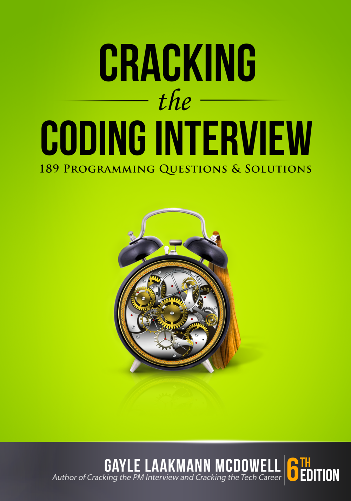

# Crack the Coding Interview
Attempts and solutions on the exercises provided in Crack the Coding Interview by Gayle Laakmann McDowell

I found the book to be an excellent resource to learning algorithms and data structures and this repository will act as a goal setter in order to learn how to prepare for interviews and greatly increase my knowledge on problem solving. If you find anything incorrect feel free to create an issue or to open a pull request. I will try to update this as much as possible through my summer 

The exercises answered and attempted on this repository are based on the sixth edition printing of the book
Other printings of the book (especially older ones) may have exercises in a slightly different order.

